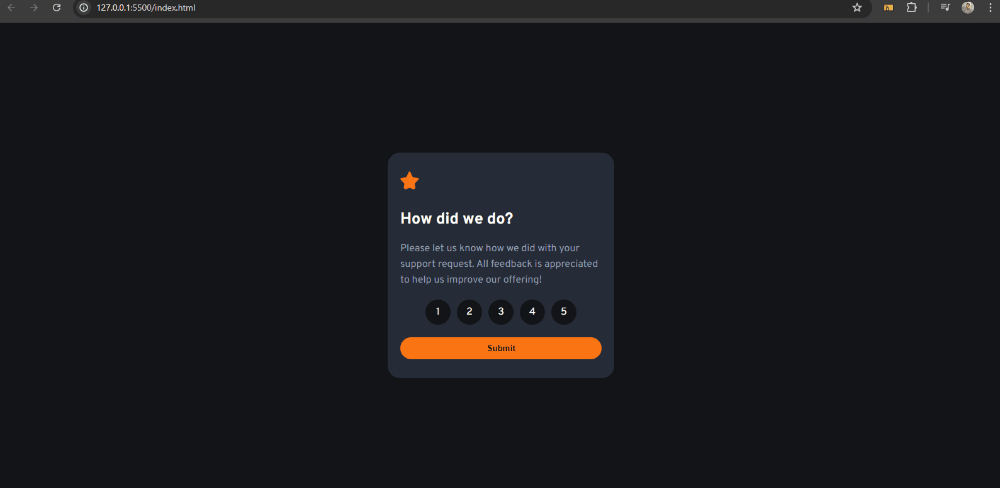

# Interactive Rating Component - Frontend Mentor

O desafio do Frontend Mentor  que envolve a criação de um componente interativo de avaliação (rating) em uma página web. 

### Objetivo:
Criar um componente de avaliação onde os usuários podem selecionar uma nota de 1 a 5 estrelas e enviar sua escolha.

## Funcionalidades Principais:

#### Seleção de Avaliação:

 1- O usuário pode clicar em uma das estrelas para selecionar a nota desejada.

2- A seleção pode alterar a cor ou o estilo das estrelas para refletir a escolha do usuário.
Exibição de Feedback:

Após a seleção, o componente deve exibir uma mensagem de agradecimento ou feedback confirmando a seleção da nota.

## Tecnologias utilizadas

- Html
- Css
- JavaScript
